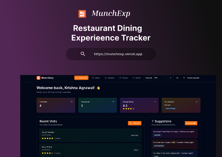
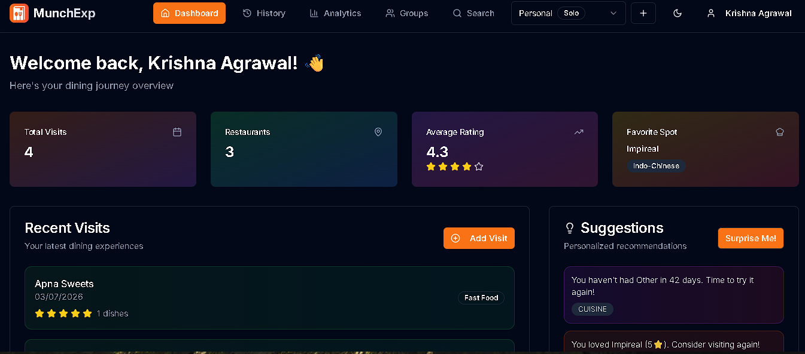
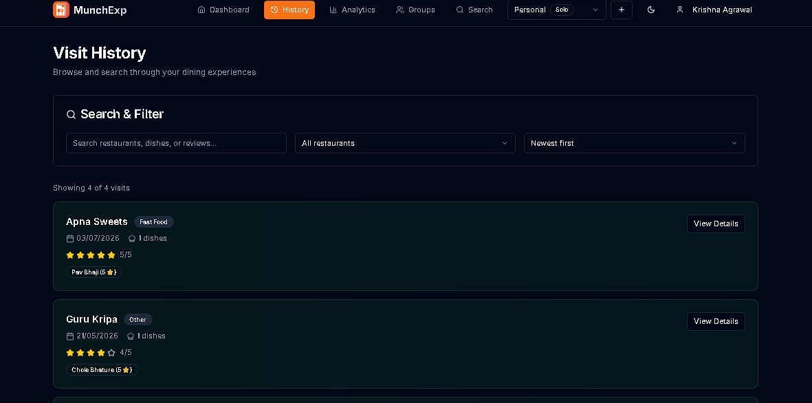
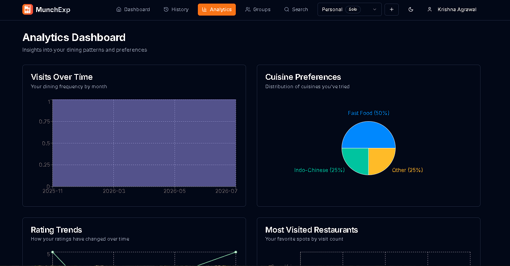

[](https://react.dev)
[](https://www.typescriptlang.org)
[](https://nodejs.org)
[](https://www.mongodb.com)
[](https://tailwindcss.com)
[](https://github.com/marketplace/models)
[](https://firecrawl.dev)

* * * * *

Landing Page
--------

<div align="center">
  
</div>

#### Demo : https://munch-exp-nu.vercel.app

* * * * *


## Overview

**MunchExp** is a full-stack restaurant dining tracking and food review application tailored for food-loving groups and families. It enables users to document and analyze their culinary experiences by logging detailed restaurant visits, reviewing individual dishes, and leveraging smart analytics and suggestion engines to guide future food adventures.

Whether you're planning your next meal out or simply want to remember what you ordered last time, MunchExp turns your dining habits into meaningful insights.

* * * * *

## Features

### 📍 Restaurant Visit Tracking

-   Log each visit with date, restaurant name, and location

-   Add reviews and ratings for the restaurant and individual food items

-   Select from previously visited restaurants for quick logging

### 📊 Advanced Analytics Dashboard

-   Visual breakdown of cuisines, visit frequency by day/month

-   Bar and pie charts powered by complex MongoDB aggregation queries

-   Insights into most-visited restaurants, frequently ordered dishes, and rating trends

### 🔍 Smart Recommendation Engine

-   Suggests restaurants and dishes based on:

    -   Past ratings and reviews

    -   Cuisine types you haven't had in a while

    -   Seasonal and time-based trends

    -   Variety and diversity of food experiences

### 📅 Visit History

-   Detailed chronological history of all visits

-   Easily search and filter by restaurant, cuisine, or rating

### 🔀 Multi-Group Support

-   Create and manage groups (e.g., Family, Friends)

-   Track food journeys across different groups

### 🌐 Fully Responsive Design

-   Optimized for both desktop and mobile

-   Adaptive navigation menu for seamless mobile experience

* * * * *

## Tech Stack

-   **Frontend**: Next.js 14, Tailwind CSS, ShadCN UI

-   **Backend**: Next.js API Routes (Server Actions)

-   **Database**: MongoDB with Mongoose

-   **Authentication**: Custom token-based authentication

-   **Deployment**: Vercel

-   **Data Visualization**: Recharts

-   **Design System**: Accessible, dark-mode compatible UI using ShadCN

* * * * *

## Key Technical Highlights

### Complex MongoDB Aggregations

Used MongoDB's powerful aggregation pipeline to generate insights such as:

-   Most ordered items by rating frequency

-   Least visited cuisines

-   Weekly and monthly visit frequency trends

-   Personalized recommendations based on group behavior and historical data

### Real-time Suggestions

The recommendation engine dynamically analyzes user patterns to:

-   Avoid repetitive cuisines

-   Suggest under-explored categories

-   Prioritize high-rated experiences

### Scalable Data Model

Built around normalized schemas for:

-   Restaurants

-   Items

-   Visits (linked by ObjectIds)

-   Groups and Users

### Clean UX with State Isolation

-   Separated concerns between visit logs and analytics

-   Smooth navigation without re-renders

* * * * *

## Screenshots

*Include screenshots here for:*

<div align="center">Dashboard</div>

  <div align="center">
    
  </div>

* * * * *

<div align="center">Visit History Page</div>  
  <div align="center">
      
    </div>

* * * * *

<div align="center">Analytics Page</div>
  <div align="center">
      
    </div>
    
* * * * *

<div align="center">Suggestions Output</div>


* * * * *

## How to Run Locally

```
git clone https://github.com/krishna-Agrawal23/MunchExp.git
cd MunchExp
npm install

# Add your .env file with MongoDB URI
npm run dev

```

## 🤝 Contributing

Contributions are welcome! Please read the [Contributing Guide](CONTRIBUTING.md) first.

```bash
# 1. Fork the repository
# 2. Create your branch
git checkout -b feature/your-feature

# 3. Commit your changes
git commit -m "feat: add your feature"

# 4. Push and open a PR
git push origin feature/your-feature
```

See also: [Code of Conduct](CODE_OF_CONDUCT.md) · [Security Policy](SECURITY.md)

<br/>

## 📝 License

MIT License — see [LICENSE](LICENSE) for details.

<br/>


## 👨‍💻 Author

<div align="center">

  


<br/>

If this project helped you, please give it a ⭐

[](https://github.com/krishna-Agrawal23/MunchExp)

</div>

<br/>

<div align="center" text="bold">
  MunchExp : A smarter way to track, review, and relive your food memories.
</div>


